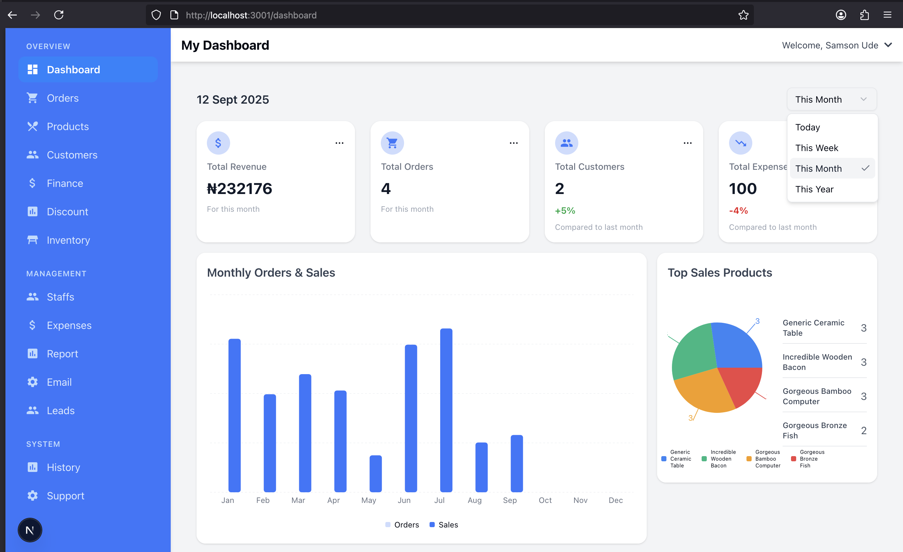

# Ecommerce Dashboard - Clean Architecture

A modern ecommerce dashboard built with Next.js, TypeScript, and TanStack Table.
This project follows Clean Architecture to ensure scalability, maintainability, and testability.

## Features

- Dashboard Analytics – Orders, sales, revenue trends, top products

- Orders Management – Pagination, filtering, search, sorting, export (CSV)

- Products Management – CRUD operations, inventory control

- Customers Management – Profiles, order history

- Payments Tracking – Payment & shipping statuses

- Graph & Reports – Monthly sales, top-selling products

- Clean Architecture – Separation of concerns across Domain, Application, Infrastructure, Presentation

## Clean Architecture Overview

This project uses Clean Architecture principles:

```bash
📂 src
 ┣ 📂 domain          # Core business logic (Entities, Interfaces, Repositories)
 ┣ 📂 application     # Use cases (business rules, orchestration)
 ┣ 📂 infrastructure  # Implementations (API calls, DB, external services)
 ┣ 📂 presentation    # UI layer (Next.js pages, components, hooks)

```


## Layers Explained

### Domain

-Entities: Order, Product, Customer

- Interfaces: IOrderRepository, IProductRepository

- Pure and framework-independent

### Application

- Use Cases: Encapsulate business logic (e.g., ListOrdersUseCase)

- Coordinate repositories and domain models

- Testable in isolation

### Infrastructure

- API clients, DB access, external integrations

- Implements repository interfaces (OrderApiRepository)

- Can be swapped without affecting business rules

### Presentation

- React components, hooks (useOrders)

- UI logic, user interactions, rendering data

- Talks only to the Application Layer

## Tech Stack

- Frontend Framework: Next.js 

- Language: TypeScript

- UI Components: TailwindCSS + Shadcn UI

- Data Layer: TanStack Table v8

- Icons: Lucide-react, react-icons

- State Management: React hooks, context 

- API Client: Axios

## Installation
```bash

git clone https://github.com/psalmsin1759/ecommerce_dashboard_clean_architecture.git
cd ecommerce_dashboard_clean_architecture

npm install

npm run dev

```


## Example Flow

### Order Listing

- presentation/hooks/useOrders.ts → fetches orders with filters, pagination

- Uses ProductListUseCase from Application Layer

- Which calls OrderApiRepository (Infrastructure)

- Which implements IOrderRepository (Domain)

### Analytics Graph

- analytics.hook.ts → fetches counts & totals

- Uses graphData method from OrderRepository

- Returns monthly breakdown for the dashboard

### This strict separation ensures that:

- The UI can change without breaking business rules

- The API implementation can change without breaking the UI

- The Use Cases are testable and reusable


### Benefits of Clean Architecture

- Testable – Business rules isolated from UI & frameworks

- Scalable – Easy to extend features without breaking layers

- Maintainable – Clear separation of concerns

- Flexible – Swap APIs, databases, or UI frameworks with minimal impact


### Screenshot:
Dashboard
